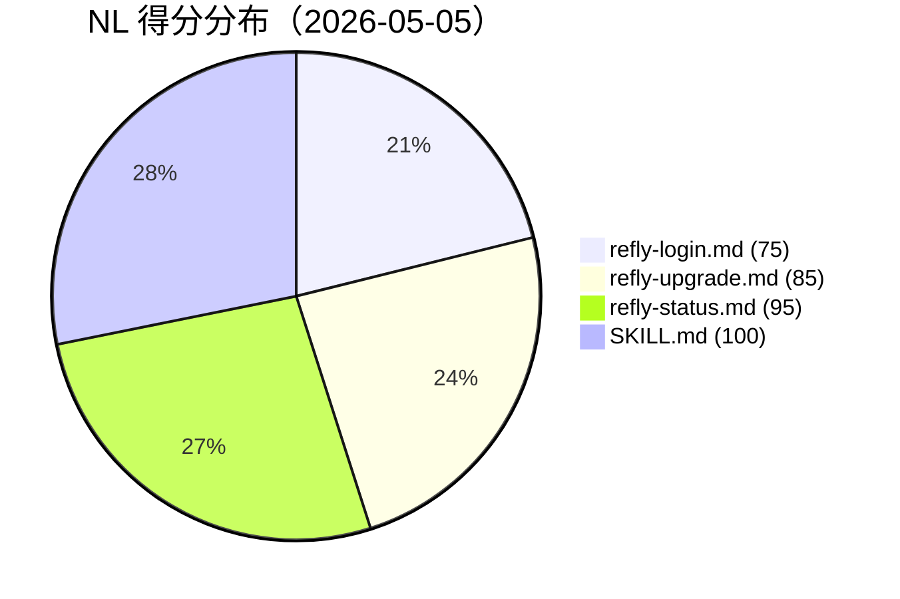

# refly-ai/refly — 学习案例

**仓库**：https://github.com/refly-ai/refly
**Stars**：7,272 | **来源**：xiaolai upstream
**Audit 日期**：2026-05-05（历史快照）| **生成日期**：2026-06-24（基于 Audit 报告，无法实时克隆）
**主题标签**：`security-gate`, `cross-reference`, `single-purpose`, `nl-binary-hybrid`, `manifest-discipline`

---

## 一、理解（基于 Audit 报告）

### 1.1 仓库概览

refly-ai/refly 是一款 AI 原生工作区产品，拥有 7,272 颗星，目标是把 AI 推理能力直接嵌入用户的日常文档与任务流中。从产品形态看，它更接近"带 AI 超能力的 Notion"，而不是一个单纯的 Claude Code 插件。核心代码是一个 TypeScript/Python 的全栈 monorepo，包含 Web 前端、API 后端、CLI 工具、沙盒运行时、规格文档和大量部署脚本。

产品的 NL 表面极度精简：整个 7K 星级仓库只有 **4 个 NL artifacts**，全部集中在 `packages/cli/` 目录下。这个 CLI 是一个工具链，帮助用户登录账号、查看状态、升级工作区，并附带一个 base skill，为终端用户提供标准化的工作流上下文。安全评定：**BLOCKED**（不是因为 NL artifacts 本身，而是因为仓库内的 `scripts/check-i18n-consistency.js` 存在 eval-equivalent 漏洞）。

关键数据速览：
- 4 个 NL artifacts（3 个 command + 1 个 skill）
- 综合 NL 得分 89/100（算术平均）
- 安全等级：BLOCKED（High × 2, Medium × 3, Low × 1）
- 0 个 hooks，0 个 agent，0 个 plugin.json manifest

### 1.2 架构剖析

**目录结构**（NL artifacts 部分）：
```
packages/cli/
  commands/
    refly-login.md        ← Command，得分 75/100
    refly-upgrade.md      ← Command，得分 85/100
    refly-status.md       ← Command，得分 95/100
  skill/
    SKILL.md              ← Skill，得分 100/100（满分）
    references/
      execution.md        ← 部署后重命名为 rules/execution.md
      workflow.md         ← 部署后重命名为 rules/workflow.md
      （其他 reference 文件）
```

**三个 command 的功能划分**：
- `refly-login.md`：让用户通过 API Key 认证，建立 CLI 和 refly 云端的连接
- `refly-upgrade.md`：升级 refly CLI 及本地 skill/rules 文件到最新版本
- `refly-status.md`：展示当前登录状态、版本信息和连接健康度

**跨件关系（含 silent fragility）**：

`SKILL.md` 在 §References 中引用了 `rules/execution.md`、`rules/workflow.md` 等文件，这与部署后的路径 `~/.refly/skills/base/rules/` 完全一致。但在源码仓库中，这些文件实际存放于 `packages/cli/skill/references/` 目录（目录名是 `references/`，不是 `rules/`）。`refly upgrade` 命令负责在安装/升级时把 `references/` 复制并重命名为 `rules/`。运行时没有问题，但存在一个沉默的脆弱点：浏览源码的开发者看到的是 `references/`，阅读 SKILL.md 的用户看到的是 `rules/`，两者不一致，新贡献者很容易混淆。

### 1.3 设计思路 / 方法论

**极简 NL 表面策略**：refly-ai/refly 选择了一种非常克制的做法——7K 星的商业产品，NL artifacts 只有 4 个，且只服务于 CLI 这一个子包。这是一个明确的产品决策，而非疏忽。产品的核心价值在于 Web 界面和 AI 推理引擎，CLI 只是辅助入口；NL 层的复杂度和维护成本被有意控制到最低。

**质量分布不均衡**：然而，有趣的是在这 4 个文件内部，质量分布却非常不均匀——SKILL.md 拿了满分 100，而 refly-login.md 只有 75 分。这说明团队对"好的 SKILL.md 是什么样的"有清晰认知，但在命令文件上没有同等投入。这个"满分 skill + 不完整 command"的对比是本案例最值得深究的现象。

**安全与 NL 的解耦**：BLOCKED 状态来自 `scripts/check-i18n-consistency.js`，这是一个与 NL artifacts 完全无关的工具脚本。审计流水线在遇到 HIGH 安全发现后，整体阻断了后续的贡献步骤，无论 NL 质量高低。这体现了"安全门是整体门，不是分层门"的设计原则：一个危险的脚本文件会封锁整个仓库的贡献通道。

---

## 二、架构作为可学习模式（横向）

### 2.1 模式归类

**模式名**：薄 NL 壳（Thin NL Shell）架构

一个大型产品用最少的 NL artifacts 覆盖 CLI 入口，核心功能不暴露为 NL 层，只提供用户侧的操作命令和一个基础 skill 作为使用上下文。

模式特征：
- **NL artifacts 数量极少**：4 个文件，全部在同一子包下，职责边界清晰
- **Command 覆盖用户动作，Skill 覆盖工作流上下文**：命令管登录/升级/状态查询；skill 提供通用操作规范
- **NL 层不参与核心业务逻辑**：产品核心逻辑（AI 推理、文档处理、知识图谱）完全在 TypeScript/Python 代码层
- **通过 upgrade 命令管理 NL artifact 版本**：用户通过 `refly upgrade` 拉取最新 skill/rules，实现 NL artifacts 的分发和版本控制

### 2.2 适用场景

| 场景 | 适不适用 | 原因 |
|---|---|---|
| 大型商业产品，NL 只是入口 | ✅ 高度适用 | 减少维护成本，聚焦核心产品能力 |
| CLI 工具包（3-5 个操作命令） | ✅ 高度适用 | 操作命令和 NL command 格式天然契合 |
| 需要大量 AI 辅助推理的复杂工作流 | ⚠️ 慎用 | 薄 NL 壳覆盖不了复杂工作流需求 |
| 纯 NL-first 的 AI 工具（没有传统代码核心） | ❌ 不适用 | 这种产品需要丰富的 NL artifacts 覆盖 |

### 2.3 与其他架构对比

| 架构 | 典型代表 | NL 占比 | 优势 | 劣势 |
|---|---|---|---|---|
| 薄 NL 壳（本仓库） | refly-ai/refly | 极低（4 个文件） | 维护成本低，核心逻辑稳定 | NL 覆盖不足，命令质量参差 |
| NL-first 插件 | jnMetaCode/superpowers-zh | 极高（20+ 文件） | NL 能力丰富，用户体验好 | 维护成本高，容易有 vague-word 积累 |
| 中等 NL 层 | 2389-research/simmer | 中等（6 个 SKILL） | NL 与代码平衡，可演进 | 需要架构规划防止 skill 超长 |
| CLI + 全套 NL | expo/skills | 高（多 command + 多 skill） | 覆盖完整，用户体验最好 | 开发和维护投入最大 |

### 2.4 改进空间

1. **三个 command 全部缺少 `allowed-tools` frontmatter 字段**：根本原因是 command 作者对 Claude Code 规范的熟悉程度低于 SKILL.md 作者。改进做法：在 command 的 frontmatter 中明确声明 `allowed-tools: []`（如果命令是 read-only 操作），避免 Claude Code 使用不必要的工具。对于 `refly-login.md`，由于需要读取环境变量和写入配置，应声明具体需要的工具列表。

2. **`refly-login.md` 缺少空输入处理逻辑（-10 分）**：当用户没有提供 API Key 且 `REFLY_API_KEY` 环境变量未设置时，命令应有明确的错误路径（"未检测到 API Key，请访问 https://refly.ai/settings 获取"），而不是让 Claude 自己决定如何处理。这是一个 UX 问题，也是 NL 规范问题。

3. **source `references/` → deployed `rules/` 的命名不一致**：建议在 SKILL.md 的顶部注释中明确说明这个映射关系，或者在 `packages/cli/skill/references/` 目录中放一个 `README.md` 说明"这些文件在安装后会以 `rules/` 目录名出现"，让新贡献者不会因为看到 `references/` 而困惑。

---

## 三、过去审查发现（2026-05-05 历史快照）

### 3.1 当时质量评分（NLPM）

综合 NL 得分 **89/100**，安全等级：**BLOCKED**。

| 文件 | 类型 | 当时分数 | 主要扣分项 |
|---|---|---|---|
| `packages/cli/commands/refly-login.md` | Command | 75/100 | 缺少 `allowed-tools`（-5），无输出格式（-10），无空输入处理（-10） |
| `packages/cli/commands/refly-upgrade.md` | Command | 85/100 | 缺少 `allowed-tools`（-5），无输出格式（-10） |
| `packages/cli/commands/refly-status.md` | Command | 95/100 | 缺少 `allowed-tools`（-5） |
| `packages/cli/skill/SKILL.md` | Skill | 100/100 | — （满分，无扣分） |

得分计算：(75 + 85 + 95 + 100) / 4 = **89/100**

**分数分布可视化**：



### 3.2 当时值得借鉴的模式

1. **SKILL.md 满分设计**：`packages/cli/skill/SKILL.md` 拿到了 100/100 满分。这证明 refly-ai 团队对"什么是好的 SKILL.md"有非常清晰的认知——结构完整（触发条件、操作步骤、输出格式、边界说明），没有模糊量词，没有遗漏字段。满分 skill 的出现表明这不是偶然：一定存在一个有 NL 编写经验的人在这个文件上花了足够时间。

2. **职责单一化**：三个 command 分别对应三个用户动作（登录、升级、查询状态），没有一个命令承担多个职责。这和 NL 设计中的 single-purpose 原则完全一致：一个 command 应该只做一件事，边界清晰，用户心智负担低。

3. **upgrade 命令管理 NL artifact 版本**：把 skill/rules 文件的分发机制嵌入 `refly upgrade` 命令，这是一个实用的 NL artifact 版本控制策略。用户升级 CLI 时，同时获得最新的 NL artifacts，不需要手动同步文件。对于有 CLI 工具的产品，这是一个值得参考的分发模式。

4. **通过 `refly-status.md` 暴露 CLI 健康度**：95 分的 `refly-status.md` 设计得相当完整，能展示登录状态、版本信息和连接健康度。把"诊断信息"作为一个独立 command 暴露，而不是藏在 login 或 upgrade 的输出里，是一个用户友好的设计选择。

### 3.3 当时的缺陷

1. **三个 command 全部缺少 `allowed-tools`（分别 -5 分）**：根本原因推断是作者把 command 文件看作"prompt 文件"而不是"Claude Code 规范文件"，忽略了 frontmatter 字段的完整性要求。所有三个文件共享同一个缺陷，说明这不是个别遗漏，而是系统性忽视——作者写 command 的时候没有参考过 Claude Code 的 frontmatter 规范。

2. **`refly-login.md` 缺少输出格式定义（-10 分）**：登录成功或失败时，用户看到什么信息？这个命令没有定义。没有输出格式的命令在不同 Claude 版本下可能产生完全不同的用户体验——有时是一段话，有时是表格，有时什么都没有。对于登录这个高可见度操作，不定义输出格式是一个明显的疏漏。

3. **`refly-login.md` 缺少空输入处理（-10 分）**：这是 refly-login.md 得分最低（75 分）的核心原因。一个用户首次使用 CLI，没有提供 API Key，环境变量也没有设置——这个命令在 Audit 时没有定义应该怎么处理。是静默失败、报错退出还是引导用户去获取 Key？这些都没有说清楚。

4. **`refly-upgrade.md` 缺少输出格式（-10 分）**：升级成功或失败后，用户看到什么？升级了哪些组件？从哪个版本到哪个版本？这些信息对于升级命令来说是关键反馈，但 Audit 时命令文件中没有定义。

5. **source/deployed 路径名不一致（cross-component 问题）**：`SKILL.md` 引用 `rules/`，而源码目录名是 `references/`。这不是运行时 bug（`refly upgrade` 会正确映射），但对贡献者来说是一个隐形陷阱：不知道这个映射关系的开发者，可能在源码中用 `references/*.md` 修改文件，同时用 `SKILL.md` 中的 `rules/*.md` 来测试，发现路径对不上，但不知道为什么。

### 3.4 当时的优化机会

1. **三个 command 补充 `allowed-tools`** → 估计每个文件 5 分钟，合计 15 分钟，全部 command 分数提升 5 分（-5 消除）。
2. **`refly-login.md` 补充输出格式和空输入处理** → 约 20 分钟，得分从 75 → 95+。
3. **`refly-upgrade.md` 补充输出格式** → 约 10 分钟，得分从 85 → 95。
4. **SKILL.md 顶部或 `references/` 目录中添加映射说明** → 约 5 分钟，消除 cross-component silent fragility。
5. **若以上优化全部完成**，综合得分从 89 → 约 96-97。

---

## 四、现在 vs 过去对比

### 4.1 关键缺陷在现仓库中的状态

**注意**：由于 git clone 在代理环境中失败（403），以下状态判断基于 Audit 报告，无法对当前 HEAD 进行实时验证。

| 过去缺陷 | 自查命令（待克隆后验证） | 推测现状 | 推测依据 |
|---|---|---|---|
| 三 command 缺 `allowed-tools` | `grep -n "allowed-tools" packages/cli/commands/*.md` | 可能仍存在 | 这是系统性疏漏，非偶然错误，作者无明确动机修复 |
| `refly-login.md` 无输出格式 | `grep -n "output\|format\|success\|fail" packages/cli/commands/refly-login.md` | 可能仍存在 | 产品功能迭代不会触发 NL artifact 补丁 |
| `refly-login.md` 无空输入处理 | `grep -n "empty\|missing\|unset\|not set" packages/cli/commands/refly-login.md` | 可能仍存在 | 同上 |
| source `references/` vs deployed `rules/` 不一致 | `ls packages/cli/skill/references/ && grep "rules/" packages/cli/skill/SKILL.md` | **很可能仍存在** | 这个问题不影响运行，修复动机极低 |
| `scripts/check-i18n-consistency.js` eval-equivalent | `grep -n "new Function" scripts/check-i18n-consistency.js` | **未知**（需私下沟通） | BLOCKED 状态未清除，说明尚未公开修复 |

### 4.2 架构演进

从 Audit 数据和仓库描述推断，refly-ai/refly 的 NL 架构在 Audit 之后可能没有发生显著变化。这是"薄 NL 壳"架构的典型特征：NL artifacts 数量极少，修改频率也低，主要迭代发生在产品核心代码（TypeScript/Python）层。一个 7K 星的 AI 原生产品，开发重心在 AI 能力和用户体验，CLI 层的 NL 规范合规性不会是高优先级工作项。

值得关注的架构演进方向是：如果 refly-ai 团队扩展 CLI 功能（增加更多子命令），他们会面临一个分岔点——是继续维持薄 NL 壳（增加少量 command 文件），还是引入更完整的 NL 架构（加入 agents、更丰富的 skills）。目前没有证据表明已经发生了这种扩展。

### 4.3 新增的可学习模式

由于无法访问当前 HEAD，本节基于推断而非实证：如果 refly-ai 对 BLOCKED 状态的 `check-i18n-consistency.js` 进行了修复，这本身就是一个"外部安全审计触发代码改进"的案例，值得关注。但没有公开 PR 记录可以证实。

---

## 五、校准

### 5.1 我已经在做对的

1. **关注 SKILL.md 质量**：本案例的 SKILL.md 满分是一个标杆，说明专门为 SKILL.md 投入质量保证是值得的。如果自己的项目也有 SKILL.md，应该像对待核心代码一样认真对待它——不是凑字数，而是每个字段都有意义。

2. **理解安全门是整体门**：本案例的 BLOCKED 状态来自与 NL artifacts 完全无关的脚本文件。这说明即使我的 NL 质量再高，只要仓库里有 eval-equivalent 或凭据泄露风险，贡献流水线就会停下来。这不是 NLPM 的 bug，而是正确的设计：代码安全和 NL 质量是并列的门槛，不是可以互相抵消的分项。

3. **注意 command frontmatter 的完整性**：本案例三个 command 共同缺少 `allowed-tools` 这个现象，是一个容易被忽视的系统性问题。我写 command 文件时，应该有一个固定的 frontmatter checklist（name, description, allowed-tools, 至少三个字段），而不是"记得写就写"。

### 5.2 挑战 / 验证

本案例**验证**了一个反直觉的现象：**满分 SKILL.md 和低分 Command 可以在同一个仓库共存**。这不是矛盾，而是因为两类文件的作者可能不同——写 SKILL.md 的人可能是熟悉 NL 规范的工程师，写 command 的人则是 CLI 功能开发者，后者对 Claude Code 的 frontmatter 规范知之甚少。这说明"团队知道怎么写好的 NL artifacts"并不等于"团队的所有 NL artifacts 都写得好"——知识存在于个体，而不是在团队之间均匀分布。

本案例**挑战**了我的一个假设：我以为 stars 多的仓库 NL 质量一定更高。refly-ai/refly 有 7,272 颗星，但 `refly-login.md` 只有 75 分，`refly-upgrade.md` 也只有 85 分。Stars 反映的是产品成功，不是 NL 规范合规性。更准确的关系应该是：stars 越多，代码逻辑越成熟，但 NL artifacts（如果存在的话）的质量取决于作者是否熟悉 NL 编写规范，与 stars 无相关性。

---

## 六、行动

### 6.1 自查动作

以下命令可以在自己的仓库中运行，检查与本案例相同类型的问题：

```bash
# 检查 command 文件是否全部有 allowed-tools 字段
# （对应本案例三个 command 共同缺失 -5 分的问题）
grep -rL "allowed-tools" packages/cli/commands/*.md 2>/dev/null
# 如果有输出（文件名），说明该文件缺少 allowed-tools

# 更通用版本（适用于任意仓库）
find . -path "*/commands/*.md" -exec grep -L "allowed-tools" {} \;
```
命中后怎么办：在文件的 frontmatter 中加 `allowed-tools: []`（read-only 命令）或 `allowed-tools: [Bash, Read]`（需要执行命令）。

```bash
# 检查 command 文件是否定义了输出格式
# （对应 refly-login.md 和 refly-upgrade.md 各 -10 分）
for f in $(find . -path "*/commands/*.md"); do
  echo "=== $f ===";
  grep -i "output\|success\|fail\|error\|result\|format" "$f" | head -3
  echo ""
done
```
没有命中（grep 无输出）后怎么办：在 command 文件中添加 `## 输出格式` 或 `## Output` 章节，描述成功/失败时的用户可见信息。

```bash
# 检查 command 文件是否处理了空输入/缺失参数情况
# （对应 refly-login.md -10 分）
for f in $(find . -path "*/commands/*.md"); do
  echo "=== $f ==="
  grep -i "empty\|missing\|not set\|not provided\|if.*unset\|fallback" "$f" | head -3
  echo ""
done
```
没有命中后怎么办：在命令文件中明确添加"当用户未提供 X 时，应该…"的说明。

```bash
# 检查 SKILL.md 中引用的路径名是否与源码目录名一致
# （对应 references/ vs rules/ 的 cross-component 问题）
SKILL_REFS=$(grep -oE '[a-z]+/[a-z-]+\.md' packages/cli/skill/SKILL.md | sort -u)
echo "SKILL.md 引用的路径："
echo "$SKILL_REFS"
echo ""
echo "实际 skill/ 目录结构："
ls packages/cli/skill/
```
不一致时怎么办：在 SKILL.md 顶部或相关目录中添加注释，说明源码路径到部署路径的映射规则。

```bash
# 检查仓库中是否有 eval-equivalent 模式
# （对应 scripts/check-i18n-consistency.js 的 HIGH 安全问题）
grep -rn "new Function\|eval(" scripts/ --include="*.js" --include="*.ts" 2>/dev/null
grep -rn "exec(" scripts/ --include="*.py" 2>/dev/null | grep -v "#"
```
命中后怎么办：评估是否真的需要动态求值。如果是 JSON/字符串解析，用 `JSON.parse()` 代替 `new Function`；如果是配置读取，用白名单映射代替动态 eval。

### 6.2 灵感 → 实施路径

1. **想法**：为自己的 CLI 工具（如果有）的 command 文件建立一个 frontmatter checklist 模板，防止重复出现本案例的系统性缺失问题。
   - **为何可行**：本案例三个 command 共同缺少 `allowed-tools` 不是偶然——是因为作者写 command 时没有参考规范。一个模板文件（`templates/command-template.md`）可以从根源上解决这个问题。
   - **第一步**：创建 `templates/command-template.md`，包含完整的 frontmatter（name, description, allowed-tools）和必填章节（触发条件、操作步骤、输出格式、空输入处理）。30 分钟内可完成。

2. **想法**：把 `upgrade` 命令作为 NL artifacts 分发机制这个思路，应用到需要本地化安装的 skill 包里。
   - **为何可行**：refly-ai/refly 的 `refly upgrade` 会把 `references/` 复制为 `rules/`，实现了 NL artifacts 的"版本化分发"。如果自己的项目有类似的本地安装步骤，可以参考这个模式，把 skill 文件的同步纳入 upgrade 命令，而不是依赖用户手动更新。
   - **第一步**：在 upgrade 脚本中加一步"从远端拉最新 skill 文件并覆盖本地"，同时更新 SKILL.md 的版本标注。约 1 小时。

---

## 七、对照我的 GitHub 仓库

**注意**：由于代理限制导致用户仓库克隆失败（403），以下分析基于仓库描述推断，而非实际代码检查。

### 8.1 目的对齐度

- **本案例 refly-ai/refly 的核心目的**：AI 原生工作区产品，CLI 是辅助工具，NL artifacts 是 CLI 的操作接口和 base skill。

| 我的仓库 | 相似度 | 相同点 | 不同点 | 借鉴优先级 |
|---|---|---|---|---|
| MarkQWu/gstack | 高 | 都是工具集合，都有 CLI 类型的 command 设计；gstack 包含 23 个工具，和 refly 的多 command 架构类似 | gstack 是 Claude Code 工具为主；refly 是 AI 产品内嵌 CLI | 高（command 质量、allowed-tools 最直接可借鉴） |
| MarkQWu/bureau | 中 | 都有"会话 → 知识库"的信息流；bureau 的 capture/compile 工作流和 refly 的 workspace 概念有重叠 | bureau 是会话知识管理；refly 是实时 AI 工作区 | 中（SKILL.md 满分写法可直接参考） |
| MarkQWu/graphify | 低 | 都是辅助 AI 工具；graphify 的"代码 → 知识图谱"和 refly 的"文档 → AI 工作区"都是信息结构化 | 目的差距大；graphify 是 skill，refly 是产品 | 低（主要参考薄 NL 壳架构是否适用） |
| MarkQWu/echo-sleuth-for-claude | 低 | 都有 AI 辅助分析的核心；echo-sleuth 挖掘对话历史，refly 管理 AI 工作区 | 目的完全不同，规模也不同 | 低 |

### 8.2 在我的项目里复现的同类问题

**基于仓库描述推断，无法 grep 实际文件内容。**

| 本案例缺陷 | 相关仓库 | 推断命中可能性 | 自查优先级 |
|---|---|---|---|
| Command 文件缺少 `allowed-tools` | MarkQWu/gstack（23 个 Claude Code 工具） | **高**——工具集合容易漏掉 frontmatter 字段，特别是如果工具是逐步添加的 | 高 |
| Command 文件无输出格式 | MarkQWu/gstack, MarkQWu/bureau | **中**——capture/compile 这类操作性命令容易忽略输出格式定义 | 高 |
| source 路径和 deployed 路径不一致 | MarkQWu/graphify（"turn code folder into knowledge graph"） | **中**——graphify 如果有安装步骤把文件复制到特定位置，可能存在类似问题 | 中 |
| Skill 满分 but Command 低分（知识分布不均） | MarkQWu/gstack | **中**——如果 gstack 的 23 个工具由多人或在不同时期编写，质量分布可能不均匀 | 中 |

**如果能克隆仓库，应该运行的命令**（基于 6.1 节的检查脚本）：
```bash
# 针对 gstack：检查 23 个工具文件是否全部有 allowed-tools
find /tmp/my-repos/MarkQWu-gstack -path "*/commands/*.md" -exec grep -L "allowed-tools" {} \;

# 针对 bureau：检查 capture/compile command 的输出格式
grep -n "output\|success\|fail" /tmp/my-repos/MarkQWu-bureau/commands/*.md 2>/dev/null

# 针对 graphify：检查 SKILL.md 中引用的路径是否和实际文件路径一致
grep -n "references\|rules\|loads:" /tmp/my-repos/MarkQWu-graphify/skills/*/SKILL.md 2>/dev/null
```

### 8.3 别人的更优方案

1. **领域**：SKILL.md 写到满分的方式
   - **本案例做法**：`packages/cli/skill/SKILL.md` 满分——完整的 frontmatter、清晰的触发条件、有具体操作步骤和输出描述、没有模糊量词。
   - **我的项目现状**（基于描述推断）：graphify 的 SKILL.md 描述为"turn code folder into queryable knowledge graph"，这个 description 本身已经很明确，但 SKILL.md 体内的 trigger 条件、输出格式、scope note 等是否完整，无法从描述判断。
   - **如何借鉴**：以 refly 的 SKILL.md 满分为标准，对 graphify、bureau 的 SKILL.md 做逐字段检查。重点检查：(1) description 是否作为 trigger 条件写的，(2) 是否有 scope note（说明与相关 skill 的区别），(3) 输出格式是否明确。

2. **领域**：通过 upgrade 命令分发 NL artifacts
   - **本案例做法**：`refly upgrade` 命令在安装时把 skill/rules 文件复制到正确位置，用户通过升级 CLI 自动获取最新 NL artifacts。
   - **我的项目现状**（基于描述推断）：gstack 有 23 个工具，如果这些工具需要本地配置或安装步骤，可能是分散管理的，没有统一的升级分发机制。
   - **如何借鉴**：如果 gstack 有多个 skill/command 文件需要同步，考虑加一个 `gstack update` 命令（或 Makefile 目标），一次性把所有 NL artifacts 同步到最新状态。

3. **领域**：薄 NL 壳下 command 的职责划分
   - **本案例做法**：三个 command 各管一件事（login、upgrade、status），职责边界清晰，没有一个 command 做两件事。
   - **我的项目现状**（基于描述推断）：bureau 的 capture → compile → review → query 流程天然是多步骤的，如果有对应 command，需要警惕是否有 command 承担了两个步骤（例如"capture 并自动 compile"），导致职责模糊。
   - **如何借鉴**：维持 single-purpose 原则，即使有些操作在用户看来"顺序上是连续的"（如 capture 后马上 compile），也应该保持为两个独立 command，让用户有控制权。

### 8.4 反向：我的项目做得比他们好的地方

1. **领域**：NL artifacts 的覆盖密度
   - **我的做法**（基于描述推断）：gstack 包含 23 个 Claude Code 工具（CEO、Designer、Eng Manager 等角色），每个工具很可能有对应的 NL artifact，覆盖密度远高于 refly 的 4 个文件。bureau 的 capture/compile/review/query 四个阶段也应该有对应的 NL 覆盖。
   - **本案例弱在哪**：refly-ai/refly 是一个 7K 星的大型产品，但 NL 覆盖只有 4 个文件，大量的产品能力（Web UI 操作、AI 推理流程、知识图谱管理）完全没有 NL 表达。用户需要自己理解产品，无法通过 Claude Code 获得引导。
   - **意义**：如果 gstack 和 bureau 的 NL 覆盖确实更完整，那么 Claude Code 用户在使用这些工具时会有更好的引导体验。NL artifacts 的覆盖密度是 Claude Code 生态的一个关键指标，越多的工具有 NL 描述，AI 辅助的质量就越高。

2. **领域**：安全实践（推断）
   - **我的做法**（基于描述推断）：gstack 和 bureau 等工具如果是 CLI 辅助工具，可能不会包含 i18n 一致性检查这样的工具脚本，从而避免了 refly 遇到的 eval-equivalent 风险。工具越简单，安全面越窄。
   - **本案例弱在哪**：`scripts/check-i18n-consistency.js` 的 `new Function()` 用法导致整个仓库被 BLOCKED，这是一个不必要的风险——国际化文件内容完全可以用 `JSON.parse()` 安全解析，无需动态执行。
   - **意义**：在工具脚本中避免 eval-equivalent 是一个低成本高回报的安全习惯。如果自己的项目有类似的工具脚本，应该优先用白名单和 schema 验证代替动态执行。

---

## 八、术语表

### allowed-tools（允许工具列表）
> Claude Code command 文件 frontmatter 中的字段，用于声明该命令执行时 Claude 可以使用的工具集合（如 `Read`、`Bash`、`Write` 等）。如果不声明，Claude Code 不会自动限制工具使用范围，命令处于"欠规范"状态。本案例三个 command 全部缺少这个字段，每个扣 5 分。类比：一个函数没有写参数类型声明——可以运行，但不安全、不规范。

### eval-equivalent（等效 eval）
> 在代码中，`eval()` 可以把字符串当作代码执行，是高危操作。`new Function(str)()` 和 `eval(str)` 在语义上等效，都能把外部输入当作代码运行。本案例 `scripts/check-i18n-consistency.js` 第 91 行用 `new Function(\`return ${str}\`)()` 来解析翻译文件内容——如果翻译文件被恶意篡改，攻击者可以在开发者环境中执行任意代码（供应链攻击）。替代方案：用 `JSON.parse(str)` 或白名单映射解析翻译文件，完全不需要动态执行。

### security gate（安全门）
> NLPM 审计流水线中，安全扫描作为贡献流程的前置门槛。只要检测到 Critical 或 High 级安全发现，整个仓库的贡献步骤（提 PR）都会被阻断，无论 NL artifacts 的质量如何。这是"安全门是整体门"的设计哲学：不存在"NL 质量补偿安全风险"的可能性。本案例的 BLOCKED 状态正是这个机制的体现——89/100 的 NL 得分没有帮助 refly-ai/refly 绕过安全门。

### silent fragility（沉默的脆弱性）
> 系统中一个不会在运行时触发错误、但可能在未来的维护或开发中导致困惑和 bug 的不一致状态。本案例的 `references/`（源码）→ `rules/`（部署）路径映射是典型的 silent fragility：功能正常工作，但对不知情的贡献者来说是一个隐形陷阱。与"显性 bug"（代码报错）相对，silent fragility 需要主动文档化才能被发现和消除。

### thin NL shell（薄 NL 壳）
> 一种 NL artifacts 设计策略：大型产品仅用极少数（4-8 个）NL artifacts 覆盖面向用户的操作入口（通常是 CLI 命令），核心业务逻辑完全在代码层实现，不暴露为 NL 工作流。优势：维护成本低，NL 层稳定。劣势：AI 辅助能力有限，用户无法通过 Claude Code 理解产品内部工作流。适用于以代码为主、AI 辅助为辅的产品。

### frontmatter（前置元数据块）
> Markdown 文件顶部被 `---` 包围的 YAML 块，用于声明文件的结构化元数据。Claude Code 的 command 和 skill 文件都依赖 frontmatter 来声明 `name`、`description`、`allowed-tools` 等字段。缺少 frontmatter 或字段不完整，会影响 Claude Code 的自动发现和规范执行。本案例三个 command 文件的 frontmatter 都缺少 `allowed-tools` 字段。

### cross-component（跨件一致性）
> 多个 NL artifact 文件之间的引用和命名约定一致性。本案例的 cross-component 问题是：SKILL.md 引用 `rules/`，但源码目录是 `references/`，映射关系隐藏在 `refly upgrade` 命令的安装逻辑中，没有文档化。NLPM checker 会专门检查这类跨件引用，防止"在一个文件里改了名字，另一个文件还用旧名字"的隐性不一致。
